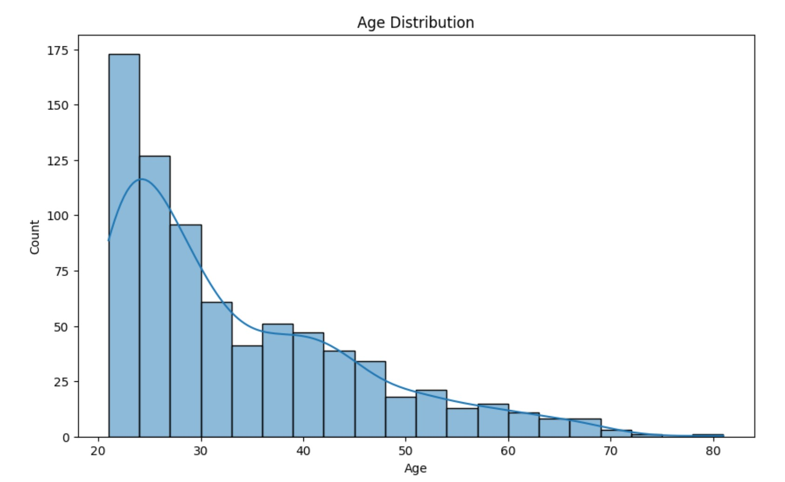

# Diabetes Patient DataAnalysis- PredictionModel
                                                           (MeriSkill Internship Project)
The analysis provides insights into diabetes prediction using certain medical measurements. While the model demonstrates predictive power, it's essential to consider its limitations and consult medical experts for comprehensive diagnosis and treatment decisions.

<table style="width: 100%;">
  <tr>
    <td style="width: 50%; text-align: center;"></td>
    <td style="width: 50%; text-align: center;"></td>
    <td style="width: 50%; text-align: center;"></td>
  
    
    
  </tr>
</table


**Introduction**

This repository contains a Python-based analysis and prediction model for diabetes diagnosis using a dataset of female Pima Indian patients. The project aims to explore the dataset, build a predictive model, and provide an interactive dashboard for making predictions. The README file provides detailed information on how to use the project and its various components.

## Project Overview

- **Data Source**: The dataset is originally from the National Institute of Diabetes and Digestive and Kidney Diseases. It focuses on diagnosing diabetes based on specific medical measurements.

- **Analysis**: The project includes data preprocessing, exploratory data analysis (EDA), and predictive modeling. It also offers an interactive dashboard for user input and visualization.

- **Predictive Model**: A logistic regression model is developed to predict diabetes outcomes.

## Dataset

- **Dataset Source**: The dataset is provided in the `diabetes_dataset.csv` file.

- **Dataset Features**:
  - Pregnancies
  - Glucose
  - BloodPressure
  - SkinThickness
  - Insulin
  - BMI
  - DiabetesPedigreeFunction
  - Age
  - Outcome (0 = No Diabetes, 1 = Diabetes)
 

**Usage**

- 1. Data Analysis: Explore the dataset, handle missing values, and visualize data patterns.

- 2. Predictive Modeling: Train the logistic regression model for diabetes prediction. Evaluate the model's performance.

- 3. Interactive Dashboard: Use the dashboard to input medical measurements and get predictions. Visualize Age vs. BMI and Insulin vs. BloodPressure.

**Exploratory Data Analysis (EDA)**

Examine the distribution of variables. Identify patterns and relationships between features. Visualize data to gain insights.

**Predictive Modeling**

Train a logistic regression model to predict diabetes outcomes. Evaluate the model using accuracy, precision, recall, and F1-score.

**Dashboard**

The interactive dashboard allows users to input medical measurements and get predictions. Scatter plots visualize Age vs. BMI and Insulin vs. BloodPressure relationships.

**Results and Conclusions**

The model achieves an accuracy of approximately 75%. The dataset exhibits differences in medical measurements between diabetic and non-diabetic patients. The project provides a screening tool, but medical professionals should be consulted for clinical diagnosis.

Contributing Contributions to this project are welcome. If you find any issues or have suggestions for improvements, please open an issue or create a pull request.

**Installation Libraries**

```pip install pandas numpy scikit-learn dash plotly```
